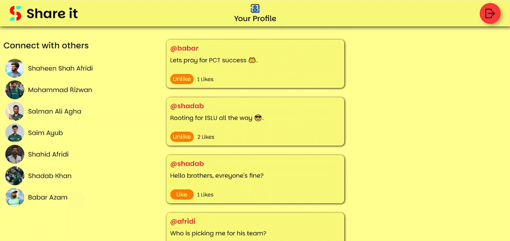

# Share It - Social Media App
## 🚀 Overview
**Share It** is a social media web application where users can share their thoughts with the world through posts. It features user authentication, image uploads, profile management, and a smooth UI built with EJS templating.

 

## 🚀 Screenshots

 

## 🚀 Features
### 🎯 Authentication & Security
- User registration and login with secure password hashing via **bcrypt**
- **JWT**-based authentication with HTTP-only cookies for secure sessions
### 🎯 User Profiles
- View your own profile with bio, avatar, and personal posts
- Edit profile details: name, email, password, and avatar
- View other users' profiles and their posts
### 🎯 Posts Management
- Create, edit, and delete your own posts
- Like/unlike posts from other users
- Posts sorted by most recent
### 🎯 Image Uploads
- Upload images for profile avatars
- Handled using **Multer** and stored locally with unique filenames
### 🎯 Social Feed
- Explore latest posts from all users
- Navigate to user profiles from feed

 

## 🚀 Tech Stack
- **Frontend:** EJS, CSS
- **Backend:** Node.js, Express.js
- **Database:** MongoDB, Mongoose
- **Image Uploads:** Multer (stored locally)
- **Authentication:** bcrypt, jsonwebtoken

 

## 🚀 Deployment
The app is deployed on <b>Vercel</b> and can be accessed via:
 
https://connect-share-it.vercel.app/

 

## 🚀 Contact
- LinkedIn: www.linkedin.com/in/ibadhussain